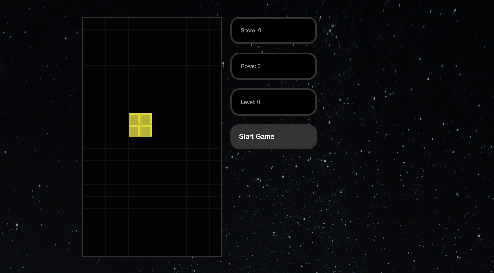

## Tetris

A gaming classic recreated with React.js 

Tetris is a tile-matching puzzle video game. The goal is to destroy lines of block before it reaches the top. As you level up the speed of the block decent will increase, making it more difficult. Using arrows to move the tetrominos into place will result in points add to your score. This was done as a project to learn React and develop an understanding of components and hooks. 

## Start Game

The start of the application will place you on level 1, when the user is ready they will click the "Start Game" button. 

## Complete The Rows

The user must analyze the falling shapes and correctly place them in a vacant cell. Each completed row will be added to the "Rows" display, after the first 10 rows the user will move on to level 2.

## Technologies

React - Bootstrap - CSS - NodeJS
